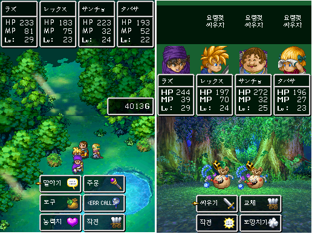
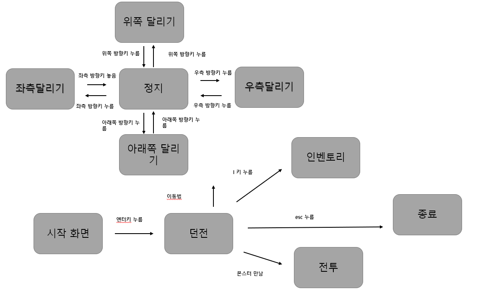

# kpu_2017102043_yuntae
- 제목. 드래곤퀘스트 

- 게임의 목적, 방법 등 간단한 설명
- 턴제 rpg로 렌덤으로 나오는 몬스터를 상대하면 던전을 공략하는 게임이다. 진행할수록 강한 몬스터가 출연하며 따라서 플레이어는 몬스터들을 사냥하여 레벨과 경험치 높여 상대해야 한다.   
2. GameState (Scene) 의 수 및 각각의 이름
총 4개
시작 화면
인벤 토리
던전
전투화면
3. 각 GameState 별 다음 항목

4. 필요한 기술
- 다른 과목에서 배운 기술
- c언어와 c++ 수업을 들으며 배웠던 클래스 문법을 사용하여 플레이어 객체와 몬스터 객체를 생성하고 각 멤버 변수로 hp, mp, 경험치 레벨 골드 등을 준다. 함수로는 전투 시 hp와 공격력을 비교하며 플레이어와 몬스터에 상태를 변경시켜주는 전투 함수와 인벤토리를 띄어주는 함수와 방향키에 따라 좌표를 변경시켜주는 함수와 변경된 값을 화면에 출력해주는 함수를 만든다.   
- 이 과목에서 배울 것으로 기대되는 기술
-실제 프레임마다 변경된 이미지를 출력하는 게임을 만들어 본적이없는 텍스트지만이 수업을 통해 프레임마다 오브젝트와 플레이어의 이미지를 변경하는 법을 배워 플레이어의 이미지를 변경하는 법을 만든 게임이 플레이되는 모습을 보는 것이 기대됩니다.  

  1.맵
  동굴을
  기반으로한 던전
  
  2.게임컨트롤러  
  좌우 상하 이동
  마우스 입력

  3.게임주요기능
  전투 시 플레이어와 몬스터에 능력치 조정
  몬스터와 플레이어에 충돌
  
  4.인벤토리을
  통한 무기 장착
  
  5.모델링
  플레이어 캐릭터와 몬스터(3종류) 보스 
  
  6.게임난이도
  아주 쉬움
  
  7.사운드
  기본 배경음과 전투시 배경음을 구별한다
  스킬 사용음  

  8.애니메이션
  플레이어 이동,
  몬스터
  출현, 공격시 이팩트  
  
  개발계획
 1주차
 이미지 리소스 수집 
 2 ~ 3주차
 플레이어 이동 구현과 몬스터 구현
 4 ~ 5주차
 맵 이동시 몬스터 충돌 구현
 6 ~ 7주차
 전투 화면 구현
 인벤토리 구현
 8주차 
버그 확인과 마무리

  
 
